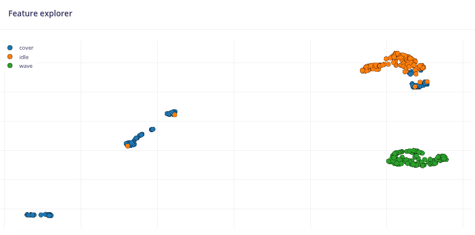
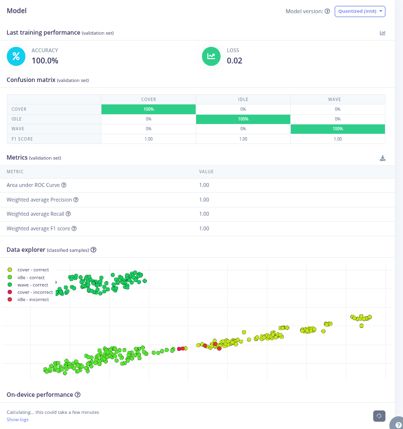
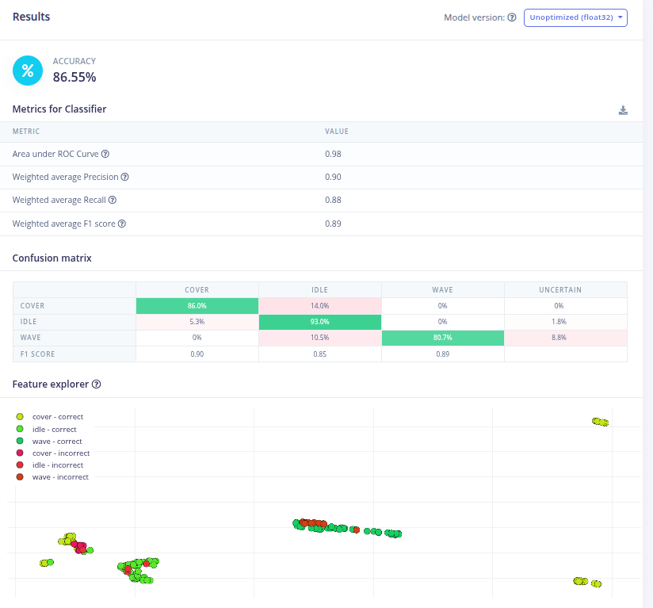

# Phase 2 — Impulse 설계·학습

> 상태: **2차 학습 완료** (2026-08-06) — `swipe`를 뺀 3-class로 **테스트 88.3%**
> 1차(4-class)는 테스트 64.9%, `wave` F1 0.07이었다. 두 결과를 모두 남긴다.
> 다음: 학습 세션 다양화, 창 3000 ms 시험

EI 프로젝트: `datapi light sensor` (ID `1079757`)

## 왜 데이터를 다 모으기 전에 학습하는가

*AI at the Edge* Ch.9 "Bootstrapping" — **최소 데이터로 파이프라인을 끝까지 한 번
통과시켜 근본 질문에 답을 받고 나서 투자하라.**

이 프로젝트의 근본 질문은 하나다: **`wave`와 `swipe`가 갈리는가.**

Phase 0부터 이 질문을 계속 추정만 해왔고, 그때마다 답이 바뀌었다.

| 시점 | 근거 | 판단 |
|---|---|---|
| Phase 0 (5초 측정) | 진폭 차이 2~7% | 주파수만이 유일한 근거, 위험 |
| 1차 수집 (10초 세션) | 주파수 3.5~4배 + 깊이 차이 | 넉넉히 갈림 |
| 2차 수집 (60초 세션) | 주파수 2배, 깊이 범위 겹침 | 다시 위험 |
| Feature explorer | 3D 투영에서 겹침 | 위험 |
| **1차 학습 (혼동행렬)** | **F1 0.97 / 0.98** (같은 조명) | **갈린다** |

**네 번 추정해서 답이 계속 뒤집혔고, 실제로 재보니 가장 잘 되는 부분이었다.**
짧은 샘플과 저차원 투영으로 판단한 탓이다.

조명 4세트(16분)를 다 모은 뒤에 이걸 알았다면, 진짜 문제(일반화)를 발견하고도
어느 방향으로 고쳐야 할지 몰랐을 것이다.

## 데이터셋 (1차 학습 시점)

| | 클래스 | 길이 | 조명 | 샘플 수 |
|---|---|---|---|---|
| Training | idle / cover / wave / swipe | 60초 | 배경 ~145 lux | 960 각 |
| Testing | idle / cover / wave / swipe | 30초 | **배경 ~90 lux** | 480 각 |

**세션이 각 1개뿐이다.** 이것이 1차 학습이 실패한 직접적 원인이 된다.

Test는 **다른 조명 조건**이다. 세션 단위로 완전히 분리되어 있으므로
"다른 환경에서도 되는가"를 실제로 측정한다 (Ch.7 — Splitting Your Data).

### 두 세션의 신호 특성

| | Training (145 lux) | Testing (90 lux) |
|---|---|---|
| `idle` | 140~150 | 87~91 |
| `cover` | 5.5~7.5 | 0~3.7 |
| `wave` | 70~140, ~1.2 Hz | 20~95, ~1.2 Hz |
| `swipe` | 75~150, ~0.6 Hz | 20~90, ~0.7 Hz |

**진폭 범위가 조명에 따라 크게 달라진다.** 모델이 절대 lux 값에 의존하면 test에서
무너진다. 이것도 이번 학습이 답할 질문이다.

`wave`와 `swipe`를 가르는 것은 이제 두 가지뿐이다:

- **주파수** — 약 2배 (1.2 Hz vs 0.6~0.7 Hz)
- **파형 모양** — `swipe`는 평평한 바탕에 좁은 스파이크가 띄엄띄엄,
  `wave`는 바탕이랄 게 없는 연속 진동

두 번째가 더 강한 신호다. 좁은 펄스는 스펙트럼에 고조파를 퍼뜨리고,
연속 진동은 기본 주파수에 에너지가 몰린다.

---

## Impulse 설정

### Create impulse

| 항목 | 값 |
|---|---|
| Window size | **2000 ms** |
| Window increase (stride) | **500 ms** |
| Frequency | **16 Hz** |
| Zero-pad data | 켜기 |

창당 32 샘플. **주파수 해상도는 1/2초 = 0.5 Hz**다.
`wave`(1.2 Hz)와 `swipe`(0.7 Hz)의 차이가 0.5 Hz — 정확히 1 bin이다. 빠듯하다.

그래도 2000 ms로 시작하는 이유: 신경망은 피크 위치만 보는 게 아니라 **스펙트럼 전체
모양**(고조파 분포)을 본다. 좁은 펄스와 연속 진동은 이 모양이 다르다.
안 되면 3000 ms로 늘린다 (해상도 0.33 Hz). 지연을 늘리기 전에 되는지부터 본다.

### Processing block: Spectral Analysis

| 항목 | 값 | 이유 |
|---|---|---|
| Scaling | 1 | |
| Input decimation ratio | 1 | 16 Hz도 이미 낮다 |
| Filter type | **none** 또는 low-pass 5 Hz | 잡음이 1 LSB뿐이라 필터 실익이 없다 |
| Analysis type | FFT | |
| FFT length | **32** | 창 샘플 수와 동일 |
| Take log of spectrum | 켜기 | 진폭 차이를 압축 → 조명 변화에 덜 민감 |
| Overlap FFT frames | 켜기 | |

**`Take log of spectrum`**: train과 test의 진폭 범위가 2배 가까이 다르므로,
선형 스펙트럼을 그대로 쓰면 모델이 절대 크기에 붙는다. 로그를 취하면 배율 차이가
덧셈 오프셋이 되어 훨씬 견딘다.

> 한때 이 옵션이 `cover`/`idle` 혼동의 원인이라고 적었으나 **틀렸다.**
> 이 블록은 FFT bin과 함께 RMS 등 통계 특징도 출력하므로 절대 레벨이 남아 있다.
> 1차 학습 결과의 정정 항목 참고.

**아직 시험하지 않은 옵션**: `Normalize features`.
조명 일반화에 도움이 될 수 있다. 다음 재학습 때 A/B로 볼 것.

### Learning block: Classification

- 기본 제안 구조(Dense 20 → Dense 10)로 먼저 돌린다
- Training cycles 100, Learning rate 0.0005
- **Data augmentation 끄기** — 1축 시계열에는 적절한 증강이 없다

RP2040 예산 (`RESEARCH.md` §3):

| 항목 | 목표 |
|---|---|
| RAM | < 100 KB |
| Flash | < 500 KB |
| Latency | < 100 ms |

이 규모 문제에서는 여유가 많을 것이다. 문제는 크기가 아니라 분리 가능성이다.

---

## 1차 학습 결과 (2026-08-05)

### Feature explorer (학습 전)

`idle`과 `cover`는 뚜렷하게 분리된 군집을 이뤘고, **`wave`와 `swipe`는 가운데
하나의 덩어리로 겹쳐 보였다.** 초록(swipe)이 왼쪽 아래, 빨강(wave)이 오른쪽 위로
경향성은 있었지만 섞여 있었다.

이 관찰로 "안 되겠다"고 판단하지 않은 것이 옳았다. Feature explorer는 수십 개
특징 중 **3개 축만 투영**한다. 분류기는 나머지 차원을 다 쓴다.

`idle`과 `cover`의 점이 유난히 적어 보이는 것은 창들이 서로 거의 같아서
(평평한 신호) 한 점에 겹쳐 찍히기 때문이다.

### `Improve low frequency resolution`은 쓸 수 없다

이 옵션을 켜려 했으나 거부됐다.

```
Error: Extra low frequency requires at least 160.0 samples
```

16 Hz에서 160 샘플 = **10초 창**. 제스처 인식에 10초 지연은 불가능하다.
창을 4000 ms로 늘려도 64 샘플이라 어림없다. 이 옵션은 이 문제에서 영구히 배제된다.

우리 신호가 전부 0.6~1.2 Hz(전체 대역 0~8 Hz의 아래쪽 15%)에 몰려 있어
정확히 이 옵션이 필요한 상황이었는데도 그렇다.

### 혼동행렬 — Validation (같은 조명 145 lux)

**정확도 94.7%, loss 0.12**

| 실제 \ 예측 | cover | idle | swipe | wave | F1 |
|---|---|---|---|---|---|
| **cover** | **88.9%** | 11.1% | 0% | 0% | 0.91 |
| **idle** | 5% | **95%** | 0% | 0% | 0.90 |
| **swipe** | 0% | 3.3% | **96.7%** | 0% | 0.97 |
| **wave** | 0% | 0% | 3.8% | **96.2%** | 0.98 |

**`wave`와 `swipe`가 갈렸다.** Phase 0부터 네 번 추정하며 걱정했던 그 쌍이
가장 잘 되는 부분이었다 (F1 0.97 / 0.98).

### ⚠️ `cover`/`idle` 혼동에 대한 최초 설명은 틀렸다 — 정정

당시 이렇게 적었다:

> 원인은 `Take log of spectrum`이다. `cover`와 `idle`은 둘 다 평평한 신호라
> 스펙트럼상 거의 같고, 절대 레벨 정보는 로그를 취하는 순간 사라진다.

**두 군데가 틀렸다.**

**(1) 백분율을 기약분수로 되돌리면 검증 세트가 극도로 작다.**

| 클래스 | 검증 창 개수 | 오분류 창 |
|---|---:|---:|
| `cover` | **9** | **1** (= 11.1%) |
| `idle` | 20 | 1 (= 5%) |
| `swipe` | 30 | 1 (= 3.3%) |
| `wave` | 53 | 2 (= 3.8%) |

`cover`의 "11.1% 혼동"은 **9개 중 1개**다. 창 하나다.
이 규모에서는 창 하나가 두 자릿수 백분율을 만든다. 원인을 논할 대상이 아니었다.

**(2) Spectral Analysis는 절대 레벨을 버리지 않는다.**

[공식 문서](https://docs.edgeimpulse.com/docs/edge-impulse-studio/processing-blocks/spectral-features)에
따르면 이 블록은 FFT bin뿐 아니라 **RMS·skewness·kurtosis 같은 통계 특징도 함께 출력**한다.
필터를 `none`으로 뒀으므로 RMS에는 DC 성분이 그대로 들어간다 —
`cover` RMS ≈ 2, `idle` RMS ≈ 145. 사소하게 분리되는 특징이 이미 있었다.

블록이 실제로 무슨 특징을 내놓는지 **확인하지 않고** 그럴듯한 인과를 만들었다.
그리고 그 틀린 인과를 근거로 Flatten 블록 추가를 제안했다 — 이미 있는 정보를
중복으로 넣자는 제안이었다.

**교훈**: 백분율은 분모를 확인하기 전까지 해석하지 않는다.
그리고 도구가 무엇을 하는지는 추측하지 말고 문서를 읽는다.
`docs/RETROSPECTIVE.md` 참고.

### 혼동행렬 — Model testing (다른 조명 90 lux)

**정확도 64.91%** — 검증 94.7%에서 무너졌다.

| 실제 \ 예측 | cover | idle | swipe | wave | uncertain | F1 |
|---|---|---|---|---|---|---|
| **cover** | **89.5%** | 0% | 0% | 0% | 10.5% | 0.92 |
| **idle** | 5.3% | **91.2%** | 0% | 0% | 3.5% | 0.87 |
| **swipe** | 0% | 17.5% | **75.4%** | 0% | 7.0% | 0.57 |
| **wave** | 0% | 0% | **87.7%** | **3.5%** | 8.8% | **0.07** |

Weighted precision 0.79 / recall 0.68 / F1 0.62. AUC 0.92.

**`wave`가 완전히 붕괴했다.** 정답률 3.5%, 87.7%가 `swipe`로 간다.

그리고 **걱정하던 `cover`/`idle`은 오히려 잘 된다** (89.5% / 91.2%).
검증에서 섞였던 것이 테스트에서는 문제가 아니었다.

### 왜 `wave`가 무너졌는가 — 학습 세션이 하나뿐

`wave`의 진폭 특성이 두 세션에서 다르다.

| | 배경 | 골 바닥 | 상대 하강폭 |
|---|---|---|---|
| Train | 145 lux | 70 | **52%** |
| Test | 90 lux | 20 | **78%** |

조명만 바뀐 게 아니라 **손을 얼마나 가까이 댔는지**가 달랐다.
학습 세션이 하나뿐이라 모델은 "그 60초의 그 진폭 패턴"을 외웠고,
다른 조건의 `wave`를 보자 `swipe`로 분류했다.

### `swipe` → `idle` 17.5%는 별개의 구조적 문제

`swipe`가 0.6~0.7 Hz라 **2초 창 중 일부에는 제스처가 아예 안 들어간다.**
그 창은 실제로 `idle`인데 `swipe` 라벨이 붙어 있다. **라벨 자체가 틀렸다.**

창을 3000 ms로 늘리면 완화된다 (2초 창엔 1~1.4회, 3초 창엔 1.8~2.1회).

### On-device 성능 (EON Compiler, int8)

| 항목 | 실측 | 목표 | 여유 |
|---|---|---|---|
| Inferencing | **3 ms** | < 100 ms | 33배 |
| RAM | **1.4 KB** | < 100 KB | 70배 |
| Flash | **14.7 KB** | < 500 KB | 34배 |

DSP만 따로 보면 1 ms / 544 바이트다.

**RP2040 예산의 1~3%.** 블록을 추가하거나 창을 늘려도 전혀 부담이 없다.
이 문제의 병목은 크기가 아니라 **일반화**다.

---

## 2차 학습 — `swipe`를 뺀 3-class (2026-08-06)

### 왜 줄였는가

사용자의 문제 제기에서 시작했다: **"애초에 `swipe`를 왜 구분하려 하는가.
`cover`와 `wave`만으로 목표를 낮게 잡는 편이 빠르지 않은가."**

이 저장소가 `swipe`를 넣었던 근거는 난이도가 아니라 교보재였다.
`cover`는 레벨, `wave`는 변화량으로 갈리므로 3-class는 요약통계만으로도
풀릴 가능성이 있고, 그러면 "DSP 블록을 왜 고르는가"를 설명할 재료가 사라진다.

그런데 1차 학습이 그 전제를 뒤집어 놓은 상태였다. 어렵다고 예측한
`wave`/`swipe`는 같은 조명에서 F1 0.97/0.98로 갈렸고, 병목은 **일반화**였다.
일반화 문제는 클래스를 줄여도 남는다 — **`wave`의 오분류가 `idle` 쪽으로
옮겨갈 뿐일 수도 있다**고 적었다. 이것은 그 시점에서 가설이었다.

추가 수집 없이 잴 수 있는 실험이었다. Studio에서 `swipe` 샘플을
**삭제하지 않고 disable**한 뒤(4-class와의 비교가 결과물이므로) 재학습했다.
**임펄스는 하나도 바꾸지 않았다** — 창 2000 ms / stride 500 ms /
Spectral Analysis 그대로. 클래스 수 하나만 바뀐 비교여야 해석할 수 있다.

### Feature explorer (학습 전)



`wave`(초록)가 독립된 덩어리로 떨어져 있고, `cover`(파랑)는 한 군집이 아니라
서너 곳에 흩어져 오른쪽 위 `idle` 무리 속에도 섞여 있다.

`cover`의 분산은 배경 조도에 따라 덮었을 때의 절대 레벨이 달라지기 때문일 수
있으나 — 145 lux에서 덮은 것과 90 lux에서 덮은 것은 RMS가 다르다 —
**축이 무슨 특징인지 확인하지 않았으므로 가설이다.** 아래 테스트 혼동행렬에서
`cover`↔`idle` 오분류가 실제로 12창 나온 것과 방향은 맞는다.

### 혼동행렬 — Validation (같은 조명 145 lux)



**정확도 100%, loss 0.02, F1 전 클래스 1.00.**

| 클래스 | 검증 창 개수 | 오분류 |
|---|---:|---:|
| `cover` | 22 | 0 |
| `idle` | 26 | 0 |
| `wave` | 23 | 0 |
| **합계** | **71** | **0** |

**이 100%는 정보가 거의 없다.** 두 가지 이유다.

1. **틀릴 기회가 71번뿐이었다.** 1차의 교훈(§ 백분율은 분모를 확인한다)을
   그대로 적용하면, 이 크기에서 100%는 "완벽하다"가 아니라 표본이 작다는 뜻이다.
2. **validation은 training과 같은 세션(145 lux, 같은 손 거리)에서 쪼갠 것**이라
   1차가 무너진 지점을 아예 건드리지 않는다. 1차도 검증은 94.7%였다.

Data explorer에는 빨간 점(incorrect)이 몇 개 보이는데, 이 화면은 training set을
포함한 분류 결과이므로 검증 100%와 모순은 아니다.

### 혼동행렬 — Model testing (다른 조명 90 lux) ← 실제 답



**정확도 88.30%**, AUC 0.98, loss 0.29. 클래스당 57창, 합계 171창.

| 실제 \ 예측 | cover | idle | wave | recall | F1 |
|---|---:|---:|---:|---|---|
| **cover** | **49** | 8 | 0 | 0.86 | 0.89 |
| **idle** | 4 | **53** | 0 | 0.93 | 0.84 |
| **wave** | 0 | 8 | **49** | 0.86 | **0.92** |

Weighted precision 0.90 / recall 0.88 / F1 0.89.

### 사전에 정한 판정 기준과 대조

실험 전에 기준을 먼저 적어 뒀다 — `wave` F1 0.8 이상이면 `swipe`가 실제 비용,
0.3 미만이면 병목은 일반화.

| | 4-class (1차) | 3-class (2차) |
|---|---|---|
| 테스트 정확도 | 64.9% | **88.3%** |
| `wave` F1 | **0.07** | **0.92** |
| `cover` F1 | 0.92 | 0.89 |
| `idle` F1 | 0.87 | 0.84 |

**기준을 넘었다. `swipe`가 실제 비용이었다는 쪽이다.**

### 무엇이 실제로 달라졌는가

**`wave`↔`cover` 혼동이 양방향 모두 0이다.** `wave` precision은 1.00 —
`wave`로 예측한 171창 중 틀린 것이 하나도 없다.
오분류 20창이 **전부 `idle`과의 사이**에서 났다.

"오분류가 `idle` 쪽으로 옮겨갈 뿐일 수도 있다"던 가설은 **절반 맞았다.**
옮겨가긴 했으나 규모가 다르다 — 1차에서 `wave` 57창 중 50창(87.7%)이
`swipe`로 갔던 것이 8창으로 줄었다.

`wave` → `idle` 8창은 2초 창 안에 손동작이 안 들어간 "빈 창"으로 보인다.
1차에서 `swipe`에 대해 진단했던 것과 같은 구조다. 다만 `wave`는 1.2 Hz로
창당 2.4회가 들어가야 하므로 같은 설명이 그대로 적용되는지는 확인하지 않았다 —
**가설이다.** 창 3000 ms 시험의 근거가 여기 하나 더 생겼다.

`cover` → `idle` 8창은 Feature explorer에서 `cover`가 흩어져 보인 것과 방향이 맞는다.

### 화면과 JSON의 숫자가 다르다 — 88.30% vs 86.55%

같은 학습 결과인데 Studio 화면은 **86.55%**, 내보낸 JSON은 **88.30%**다.

차이는 **UNCERTAIN 열**이다. 화면 혼동행렬에는 있고 JSON에는 없다.

| | 화면 (86.55%) | JSON (88.30%) |
|---|---|---|
| `wave` 행 | 80.7% wave / 10.5% idle / **8.8% uncertain** | 49 wave / 8 idle |
| `idle` 행 | 93.0% idle / 5.3% cover / **1.8% uncertain** | 53 idle / 4 cover |

화면은 confidence threshold 아래의 예측을 uncertain으로 빼고, JSON은 argmax
그대로 집계한 것으로 보인다. **문서에는 JSON 쪽(88.30%)을 쓴다** —
threshold에 의존하지 않는 숫자라 4-class와 비교할 수 있다.

> [공식 문서](https://docs.edgeimpulse.com/docs/edge-impulse-studio/model-testing)는
> "Set confidence thresholds"가 존재한다는 것만 설명하고 **기본값도, uncertain 열이
> 만들어지는 규칙도 명시하지 않는다.** 위 설명은 두 숫자의 차이로부터 추론한 것이고
> 확인되지 않았다. Studio의 threshold 값을 실제로 읽어 여기 적을 것.

원본 지표: [`data/2026-08-06-metrics-3class.json`](data/2026-08-06-metrics-3class.json)

### 이 실험이 남긴 것

절차서에 들어갈 항목은 정확도가 아니라 이것이다:
**클래스를 줄이는 것이 답이 되는 경우와 안 되는 경우를 어떻게 구분하는가.**

- 여기서는 답이 됐다. `swipe`는 `wave`와 **주파수로만** 갈렸고,
  그 주파수 차이(0.5 Hz)가 하필 FFT 해상도와 정확히 같았다.
  즉 `swipe`는 이 파이프라인의 해상도 한계 위에 놓여 있던 클래스다.
- 대신 `cover`↔`idle` 12창은 **그대로 남았다.** 클래스를 줄인다고
  없어지는 종류의 오류가 아니다.
- 그리고 **일반화 문제 자체가 해결된 것은 아니다.** 학습 세션은 여전히 1개다.
  88.3%는 "세션 1개로도 이 정도는 된다"이지 "세션 1개면 충분하다"가 아니다.

추가 수집 없이 몇 분 만에 잴 수 있는 실험이었다.
**가설(3-class로 줄이면 어떻게 되는가)을 논쟁하는 대신 재는 쪽이 훨씬 쌌다.**

---

## 부트스트랩이 무엇을 알려줬는가

6분 녹화(train 4분 + test 2분)로 세 가지를 알아냈고, **셋 다 사전 예측과 반대**였다.

| | 예측 | 실제 |
|---|---|---|
| `wave` / `swipe` | 가장 위험 | 같은 조명에서 F1 0.97 / 0.98 |
| `cover` / `idle` | 분리 확실 | 검증에서 섞였으나 테스트는 양호 |
| 진짜 문제 | 클래스 분리 가능성 | **일반화 — 세션 1개로는 안 됨** |

조명 4세트(16분)를 다 모은 뒤였다면 어느 방향으로 고쳐야 할지 몰랐을 것이다.
지금은 **무엇을 다양하게 모아야 하는지 알고** 모은다.

### Model testing을 Flatten 추가보다 먼저 돌린 것

검증 혼동행렬만 보고 `cover`/`idle`을 고치려 Flatten 블록을 붙일 계획이었다.
테스트를 먼저 돌려 그 계획을 폐기했다.

- `cover`/`idle`은 테스트에서 이미 89.5% / 91.2%로 잘 된다 — 고칠 게 없었다
- 애초에 고칠 대상이 **창 1개**였다 (위 정정 항목)
- Spectral 블록이 이미 RMS를 출력하므로 Flatten은 **중복**이었다

한 지표(검증)만 보고 움직이려던 것을 다른 지표(테스트)가 막았다.
다만 테스트가 막아주지 않았다면 그대로 진행했을 것이다 — 운이 좋았던 쪽에 가깝다.

---

## 판단 규칙

평가 관점은 Ch.10 — 전체 정확도 하나로 보지 않는다.

- **클래스별 recall** — 어떤 제스처를 놓치는가
- **`idle` → 제스처 오검출** — 실사용에서 가장 거슬리는 실패 모드
- `wave` / `swipe` 혼동 — 이 프로젝트의 핵심 질문

### `wave`/`swipe`가 혼동될 때 조치 순서

1. **창 2000 → 3000 ms** (주파수 해상도 0.5 → 0.33 Hz, 지연 감수)
2. **Raw Data + 1D Conv 시도** — 판별 특징이 미세한 주파수가 아니라 **펄스 모양**이라면,
   거친 FFT bin보다 CNN이 시간축 모양을 직접 배우는 편이 나을 수 있다.
   (계획에 적었던 Raw + Flatten과는 다르다. Flatten은 창 단위 요약통계라 반드시 실패한다)
3. **3-class로 축소** — `swipe`를 뺀다

> **2026-08-06: 3번을 먼저 실행했다.** 1·2번을 건너뛴 것은 3번이 추가 수집도
> 임펄스 변경도 없이 몇 분 만에 재지는 유일한 선택지였기 때문이다.
> 결과는 위 2차 학습 절. 순서를 이렇게 적어 뒀던 것 자체가 재고 대상이다 —
> **비용이 낮은 순으로 정렬해야 했다.**

### 조명 일반화가 안 될 때 → **지금이 그 상황이다**

Training 94.7% / Testing 64.9%. 데이터를 더 모을 때다.

> **2026-08-06 갱신.** 3-class에서 검증 100% / 테스트 88.3%로 격차가 좁혀졌지만
> **없어진 것이 아니다.** 학습 세션은 여전히 1개이고, 이 절의 수집 계획은
> 그대로 유효하다. 다만 `swipe`가 빠졌으므로 세션당 **3 클래스 × 60초**다.

핵심은 조명만이 아니라 **제스처 수행 방식의 다양성**이다.
`wave`가 무너진 직접 원인은 손 거리(골 깊이 52% vs 78%)였다.

#### 다음 수집 계획

세션 3세트 추가 (4 클래스 × 60초 × 3 = 12분). 세션마다 조건을 의도적으로 바꾼다.

| 세션 | 조명 | 손 거리 / 세기 |
|---|---|---|
| 3 | 밝게 (스탠드 추가) | 가깝게, 크게 |
| 4 | 어둡게 (조명 일부 끄기) | 멀게, 작게 |
| 5 | 중간 | 보통, 속도 변화 |

`wave`는 특히 **세션마다 손 거리를 확실히 다르게** 한다.
골 깊이가 다양해야 모델이 "깊이"가 아니라
"연속 진동이냐 간헐적 스파이크냐"를 배운다.

#### 다른 날에 찍는 편이 낫다

같은 날 오후에 3세트를 몰아 찍으면 태양 각도, 옷차림, 손을 두는 습관 같은
**숨은 변수를 공유**한다. 겉으로 조명을 바꿔도 실제 다양성은 생각보다 적다 (Ch.7).
하루를 건너뛰거나 시간대를 나누면(아침/낮/저녁) 그런 변수가 자연스럽게 흔들린다.

#### 고정할 것

| 바꿔도 되는 것 | 고정해야 하는 것 |
|---|---|
| 조명, 시간대, 날씨 | **센서 위치·방향**, 보드 |
| 손 거리, 세기, 속도, 사람 | 펌웨어 설정 (16 Hz, HIGH mt=31) |
| | **test 세트 (90 lux 세션)** |

**test 세트는 절대 다시 찍지 않는다.** 비교 기준이 고정되어야 개선을 측정할 수 있다.

#### 세션을 하나 추가할 때마다 재학습한다

3세트를 몰아 찍고 한 번 학습하는 것보다, 세션이 늘 때마다 test 정확도가 어떻게
움직이는지 보는 편이 배우는 것이 많다. "몇 세션이면 충분한가"에 대한 답이 나온다.

### 함께 시험할 것: 창 3000 ms

- 주파수 해상도 0.5 → **0.33 Hz** (`wave` 1.2 Hz vs `swipe` 0.7 Hz가 1.5 bin 차이로 벌어짐)
- `swipe`의 "빈 창" 문제 완화 (창당 1~1.4회 → 1.8~2.1회)
- 비용: 지연 1초 증가. 리소스는 3 ms / 1.4 KB라 여유가 넘친다
